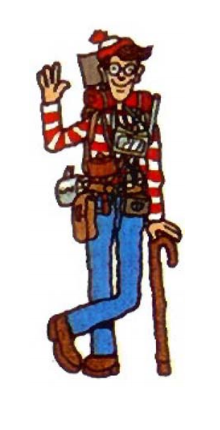
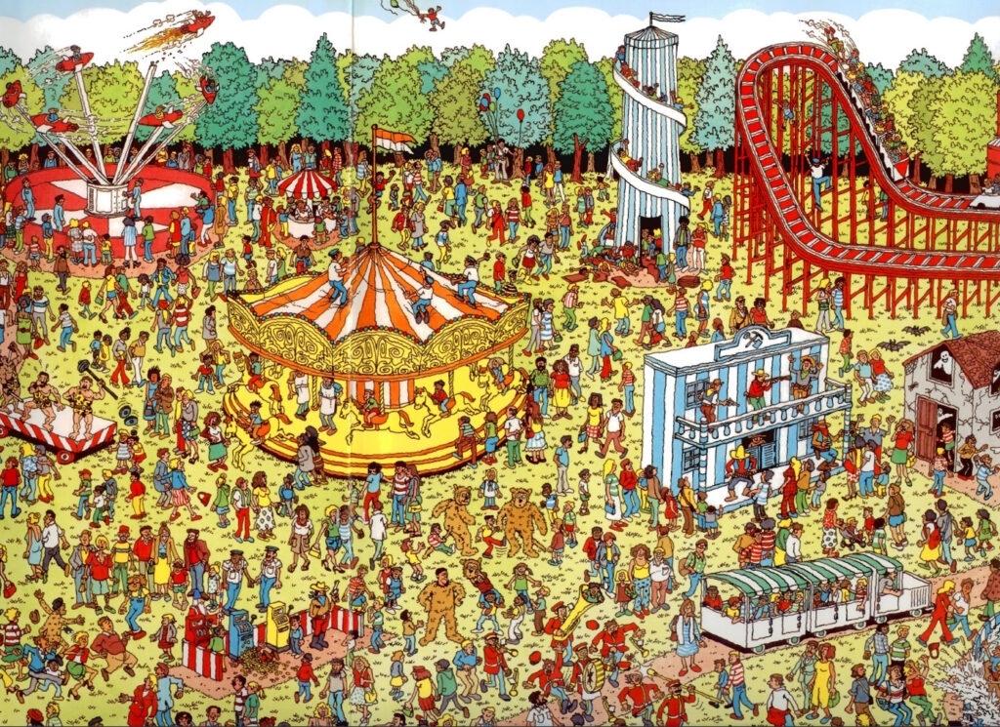

“Zero Knowledge”, contrary to what it sounds like, is actually quite interesting and fun. It might even be a solution to our long standing problem of validating the world’s transactions without a trusted third party or government or central bank. If you Google for the terms Zero Knowledge and Blockchains, you will be flooded with whitepapers, articles, explainers, investment advice, and everything in between.

What does Zero Knowledge (ZK) even mean? Let me start with a toy example, and then we can work our way up to world peace.

Say we both get the same newspaper and it has a Sudoku puzzle in the games page. I claim to you that I know the solution to this puzzle, but will not tell you what the solution is. Being the frenemy that you are, you won’t believe me, obviously. Can I prove it to you, beyond reasonable doubt, that I do know the solution to this Sudoku puzzle, without telling you what the solution is? More formally,

  * If I know a solution, I should be able to convince you of that. Without leaking any knowledge about the solution.
  * If I lie about knowing the solution, I should be caught – with overwhelming probability.

If both the above are possible, that would be a **Zero Knowledge Proof of Knowledge of a Sudoku** puzzle. There are some ingenious ways of doing this, which rely heavily on cryptographic primitives and protocol design. In fact, it’s possible to convince an audience that you know the solution for almost any puzzle without giving them any hint of the solution itself. Sudoku was just one example. You could prove that you know the solution to a crossword puzzle, or the Rubick’s cube, or that you know a cycling route from New York to Seattle that’s exactly 5000km, or that you have paid your rent, or that your bank balance is more than $10,000 or any such statement really – without actually revealing the actual solution to the statement.

Imagine the power of such a system, where you could convince others that something is true, without revealing how it is true. In most real world systems, including financial systems, to prove something to someone, you have to reveal the actual facts of the matter – and thereby reveal more than you have to.

For example, getting a visa to any country requires you to provide your bank statement – just to prove that you can afford the trip. It should be possible to prove that you can afford the trip, without revealing any financial information. Also, the proof should be real – as in, if you cannot afford the trip, you shouldn’t be able to prove such a thing and fool the visa-issuing agency. We want both sides, the prover and the verifier, to win. Just with no leak of extra information. The best kind of privacy, if you will.

### Where is Waldo?

First, I will give an example of how such a Zero Knowledge protocol looks like, to make you believe that it’s possible. Below is Waldo: Say Hi to him.

Waldo is somewhere in the amusement park image below. Can you find him? Don’t try too hard, it’s not worth it.

This “Where is Waldo” puzzle lends itself very well to a Zero Knowledge protocol. I can prove it to you that I know where Waldo is without revealing his actual location on the image. How do I do that? We run the following protocol between the two of us.

  1. You blindfold yourself. I keep a large white sheet of paper on top of the amusement park image, and ask you to remove your blindfold. You can give me one of two challenges. You should choose these challenges  _randomly_.
     1. I should remove the sheet of paper and show you the amusement park image underneath.
     2. I should cut out a small hole in the white paper right above where Waldo is on the image. If I do this, I must know where Waldo is.
  2. Repeat step #1 till you are satisfied.

Why does this protocol work?

  1. If I know where Waldo is, I can easily answer challenge #2. That part is easy. It’s not so easy to figure out why challenge #1 is required.
  2. I could cheat by keeping some other image under the paper which has just many images of Waldo on it. How do you know that it’s actually the amusement park image and not some other image that I made up? Challenge #1 to the rescue. If you had asked me challenge #1, I had to remove the entire paper and show you that this was the amusement park image in question.
  3. Note that you cannot give me both the challenges at the same time, as that would tell you where Waldo is. Only one challenge per protocol round.

If we do this entire exercise just once, you could have asked me to answer challenge #2 and I could still cheat with a probability of 50%. If we do it twice successfully, I can still cheat with a probability of 25%. If we do it three times, it reduces to 12.5%. If we do it 10 times, and you picked your challenge randomly each time, I can cheat only with a probability of 0.1%. If we repeat this 20 times, the cheating probability drops to 0.0001%. And so forth, exponentially. Again, this only works if you pick your challenge randomly. If I know in advance that you will ask me the challenge sequence, of say, 122212121222111 – I can pass all challenges easily. The protocol works only if I am unable to guess your challenge sequence.

Cryptographic researchers have proven that almost any statement can be proven in zero knowledge. Imagine that! Any statement! It’s one of the most celebrated results in theoretical computer science, all the way back from 1986. The concept of Zero Knowledge Proof itself was introduced in 1985, after the original paper was rejected in major scientific conferences in the prior years because of how absurd the idea sounded. It still sounds counter-intuitive, if you ask me.

One popularly used ZK-proof system, solving a very specific problem, is that of Digital Signatures. When you digitally sign a document, you are proving to the verifier that you know a secret key to your public key (which the verifier already knows, or is tied to your identity, or some such). For the longest time, general purpose ZK-systems, which could prove any statement, were just theoretical results – the actual proofs themselves can be quite unwieldy and inefficient. Theoretical work continued, but there were still no practical applications that needed these proofs to get smaller, or easier to understand, or even remotely workable. 25 years went by, and people were mostly happy with either revealing everything about something to prove it, or having a trusted third party (like a Bank Officer or Notary) signing a statement saying that something is true, without revealing the underlying details. Ho-hum.

### Enter Bitcoin!

Bitcoin removed the trusted third party from financial transactions. Or at least, introduced the idea that it could be done with clever cryptography and protocol design. Researchers who were toiling away in obscure labs and universities were suddenly like: “Hey, there are these amazing theoretical cryptography results from decades ago, let’s use them”. These ideas suddenly seemed ripe for more R&D to make them practical. And boy did the researchers and engineers deliver! Here’s a short list of how Zero Knowledge pervades the cryptocurrency space.

  1. **New cryptocurrencies** : Zcash, Monero, Grin, Beam, Mina, etc.
     * Everything about a transaction is hidden. Who is paying. Who is the recipient. What is the amount. Everything is hidden. Crucially though, verifiers can verify that the transaction is valid, and no one is cheating anyone. Zero knowledge magic. Details differ, but this is the general idea.
     * Additionally, Zero Knowledge proofs can verify large numbers of transactions without needing to store all those transactions. So, these ZK-blockchains can be as small as a few KB. For comparison the Bitcoin blockchain is 350GB and growing. Ethereum’s blockchain is 1TB or 5TB (depending on whom you ask) and growing.
  2. **Layer-2** : ZK-Sync, StarkNet, etc. bring the benefits of ZK-proofs to legacy blockchains like Ethereum and increase throughput quite dramatically.
  3. **Other Proofs** : Exchanges can use ZK-proofs to convince their users that they are not doing fractional reserve or rehypothecation shenanigans, and in fact, do custody all their customer assets.

### What next?

Some of these general purpose ZK-systems have quite advanced cryptography, and their security guarantees are proven sometimes under ideal settings. When I say security guarantees, what I mean is:

  * Can the prover cheat?
  * Can the verifier learn something by violating the zero knowledge principle?
  * Can we do the entire thing without relying on cryptographic assumptions?
  * Some systems rely on an initial ceremony where some trusted party has to do one-off computation. Can we remove such requirements?

Practical minded people say that this stuff is too advanced, or “moon-math” as they call it. These primitives will not make it to Bitcoin for a LONG LONG time, if at all. Bitcoin’s cryptography is from an even older generation, and has been vetted in traditional settings like e-commerce, national defense, etc. No moon-math for Bitcoin!

That doesn’t mean that Bitcoin won’t benefit from these new developments. Bitcoin has evolved to a place now where the core protocol itself won’t change that easily, but additional features have to be built on top, in other layers. ZK-proofs will reside on a secondary layer somewhere on top.

Ethereum, on the other hand, is more open to these ideas. ZK-proofs are making their way into Ethereum’s core-system slowly, but will definitely pervade Ethereum’s Layer-2 ecosystem quite thoroughly in the near future. Much faster than in Bitcoin, from what I can see. Newer blockchains will go all-in, and will be built around ZK-ideas, or will offer them as native operators or subroutines.

You have the entire spectrum of blockchain platforms – some boringly conservative, and just trying to be sound money. Some others on the bleeding edge of maths, offering true privacy through ZK-proofs and the like. I expect these to become more mainstream as privacy becomes non-negotiable. Currencies, smart contract platforms, exchanges, and every other financial intermediary will go maths-first!
