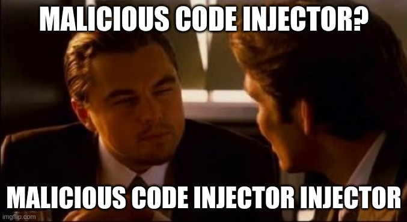

Ken Thompson is a Turing Award winner and an all-around genius – gave a seminal talk during his 1984 Turing Award acceptance called “Reflections on Trusting Trust.” In this lecture, he shows how to sneak a Trojan horse into your application (in his case, the Unix operating system) while you compile the source code of the application using the C compiler.

Say the C compiler has malicious code in it that patiently waits for pieces of code that look like Unix’s source code, and the moment it knows that it is compiling this particular source code, it adds the Trojan horse code into the final Unix compiled binary. This Unix binary now has a Trojan horse and is no longer secure.

A security-conscious user would look at their build chain and would only use a C compiler binary that they have built themselves. Before building this C binary, they will look at the C compiler code to check that such Trojan-horse-inserting malicious code doesn’t exist in their copy of the C source code. They would then compile such a clean C compiler source code to generate the C compiler binary before using that to compile the Unix binary. But how does one compile the C compiler binary? Using the C compiler, of course. This (other) C compiler binary could have malicious code that inserts malicious-code inserting code. The malicious source code used to create this malicious C compiler binary was probably written and thrown away by Ken Thompson back in 1983. The compiled version of this malicious code will self-perpetuate forever . As long as it, or one of its descendants is used somewhere along the way to build your C compiler, compiling a clean-looking C compiler source code will always get you the malicious C compiler binary. The malicious C compiler binary can now corrupt the naive Unix application binary. The maliciousness lives on – with its source long gone.

We trust Bitcoin’s blockchain because the entire blockchain can be verified from the genesis block’s hash that is hardcoded in the Bitcoin source code. We can just read the source code, convince ourselves that it does what we want it to do, compile it, and …… oh fuck!

Can we trust that compiler not to add a Trojan horse into the Bitcoin binary? For example, the genesis block’s hash value (0x000000000019d6689c085ae165831e934ff763ae46a2a6c172b3f1b60a8ce26f) has to be hardcoded in Bitcoin’s source code and can always be “sniffed” for by the compiler. To make sure that the compiler has no such sniffing code, we can look at its source, and compile the compiler first – but where are we going to find a clean compiler for that? One that has never been touched by a program touched by Ken Thompson sometime in the past? One way out of this is to write a basic C compiler from scratch using assembly language and use that to bootstrap your C compiler. Who does that? [1]Well, if someone is paranoid enough to do that – there is a new Bitcoin implementation called Mako that is implemented in pure C with no external dependencies, which can be compiled … Continue reading

Trust is a tricky thing, and sometimes, it’s turtles all the way down – and turtles come in all shapes: libraries, compilers, hardware, network routers, random number generators, cryptographic magic numbers, cryptographic assumptions, and on and on and on…..

References[+]

References ↑1 | Well, if someone is paranoid enough to do that – there is a new Bitcoin implementation called [Mako](<https://github.com/chjj/mako>) that is implemented in pure C with no external dependencies, which can be compiled to a Bitcoin binary that perhaps has no Trojan horses. Or so we hope.  
---|---
