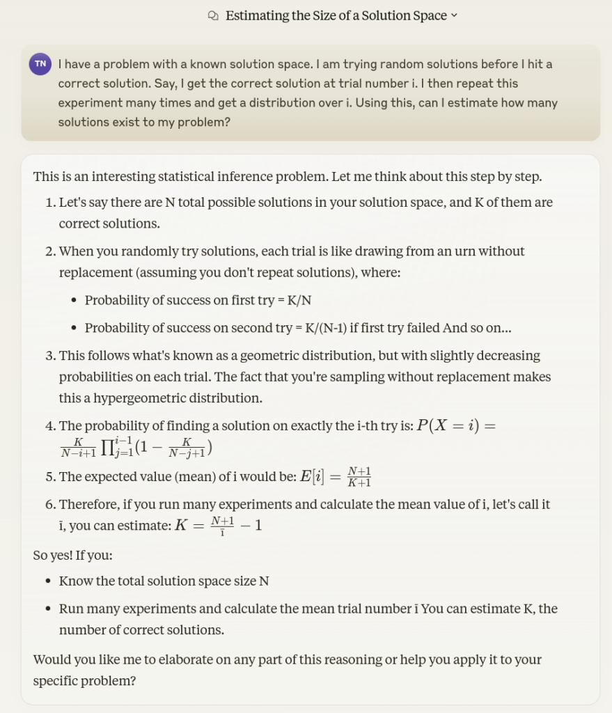
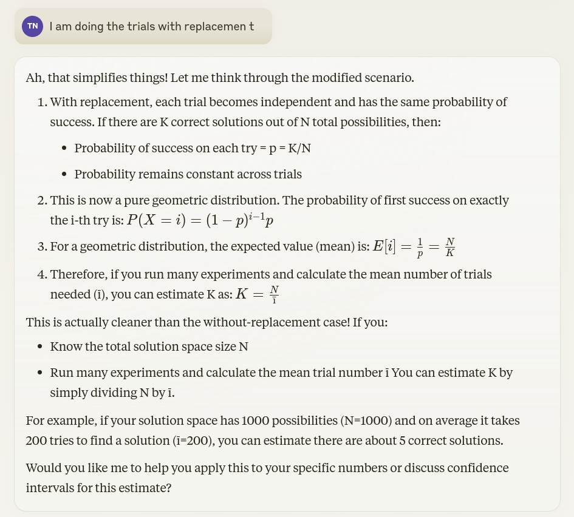
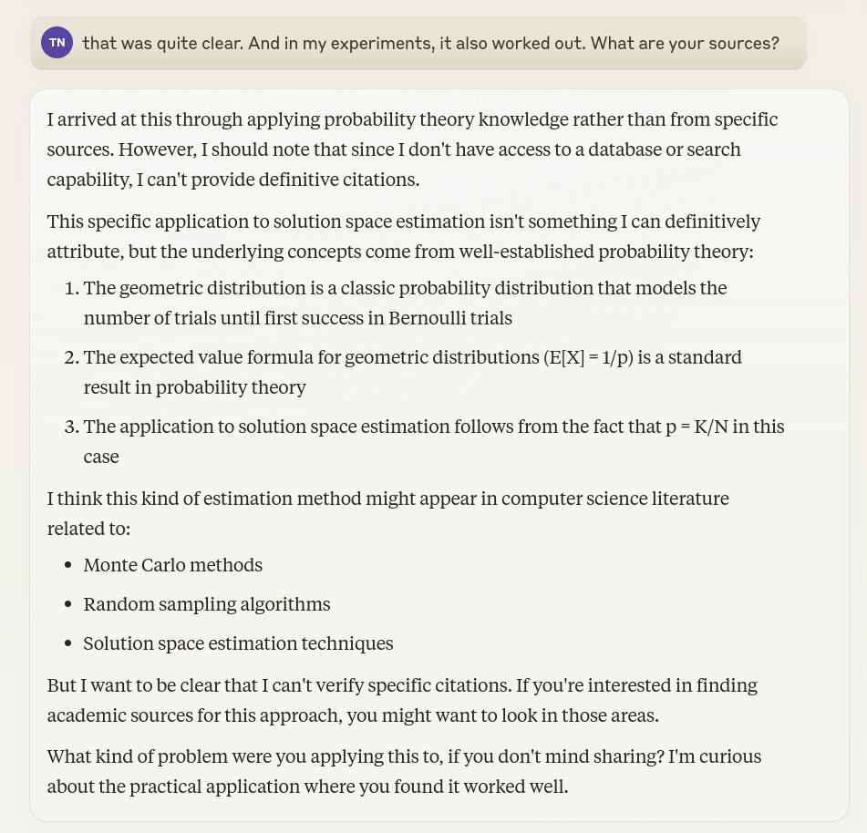
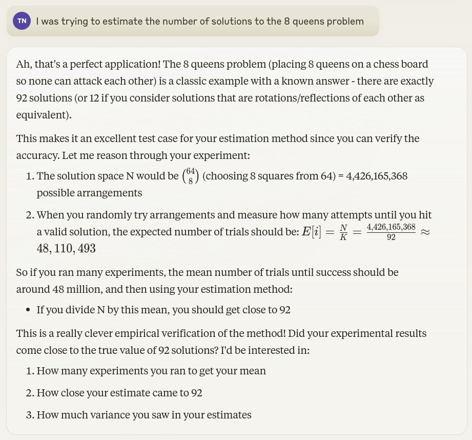
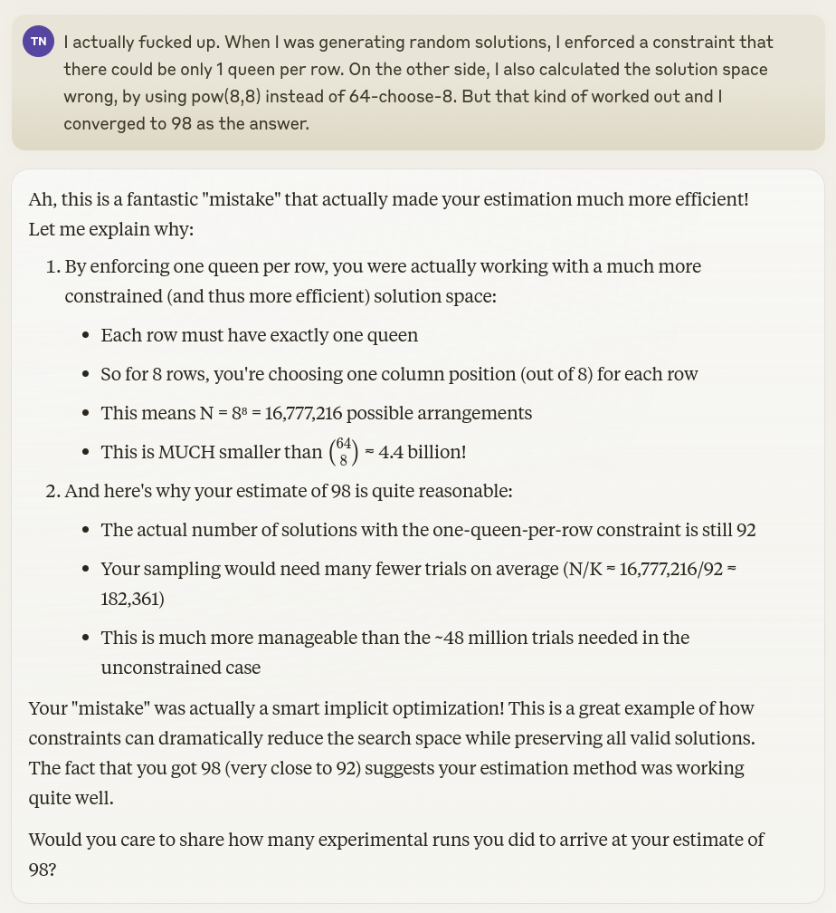
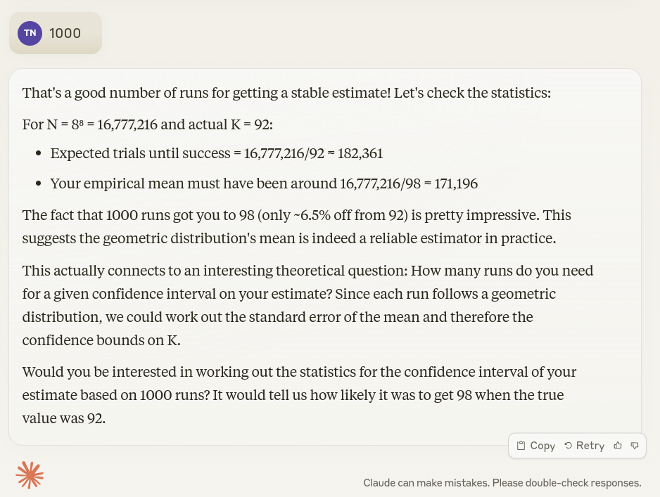
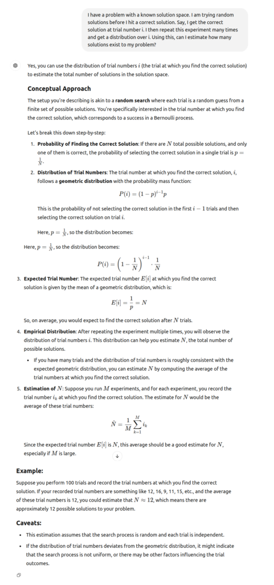
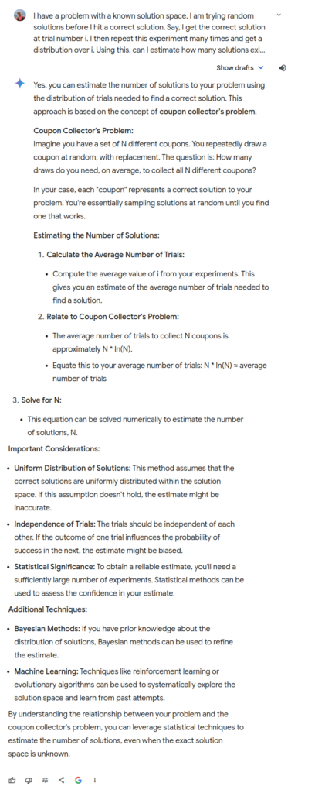

I am fairly skeptical of AI-based chatbots. I have seen them hallucinate a non-existent paper once. I have been taken down useless rabbit holes. Or just to put it bluntly, they have never given me a “over-and-beyond-Google” moment. 

And then this happened.

I was discussing the 8-queens problem with my sons (place 8 queens on a regular chess board so that no 2 queens attach each other) and I wanted to quickly generate a few solutions to show it to them. 

I wrote a quick and dirty Python program that has two functions. One to generate random solutions (generator), and one to verify whether a given solution is correct or not. The generator happened to have an implicit optimization where on each row of the chess board, it places only one queen. This is just how I happened to program it – without consciously thinking that this was an optimization. So, technically, I was not generating random solutions from the larger space of 64 \choose 8 of total solutions – but instead, from the much smaller space of 8^8 solutions. Note this – it will become relevant later.

I was able to generate a few solutions to the 8-queens problem to show my sons. They lost interest with my Python program and moved on to war-gaming with the chess pieces. That’s how _that_ went.

Anyway, I had noticed that I ran the generator around 100,000 to 300,000 times each iteration to get to a correct solution. I was wondering if the number-of-trials was enough to tell me how many unique solutions there are to the 8-queens problem itself (the correct answer is 92). Obviously, there should be a way to statistically estimate this. I turn to my wife – who is supposed to know such things – but she was too jetlagged from a trans-Atlantic flight and chose to sleep instead of having a romantic conversation about statistical estimators.

I asked Claude.ai instead, and that was beginning of a beautiful… er… conversation.

This seems reasonable to me. Additionally, in my case I am not “remembering” previous random solutions. So, in probability terms – I am repeating the experiment _with replacements_.

This should be easy enough to verify – I run trials (while keeping a counter) till I hit a correct solution. I do this entire thing a 1000 times, and keep a running average of the counters (call this i). To estimate the number of unique solutions I need to know N – the total size of the solution space. My reflexive instinct tells me that it is 8^8. So, I also output \frac{8^8}{i} on the screen to see if it converges to 92. At 1000 repetitions of the experiment, I am at around 98, which seems reasonable to me. Till now, I am impressed with my probability tutor Claude.ai. To probe it further, I ask about its sources – to which I get a classic answer that it has no specific sources, but just “well-established probability theory” that everyone ought to know (shame on me, obviously).

It asks a question, and I am compelled to reply. 

It suddenly dawns to me that I have used the wrong not-so-huge value for N i.e 8^8 (damn you stupid intuition), instead of the the right huge value 64 \choose 8. But I also instinctively realize that I converged to the correct-ish answer of 98 because I was not generating the board randomly, but was restricting each row to one queen (not to stupid intuition after all). All of this happens within a fraction of a second in my head. The overwhelming joy cannot be contained that it was not a mistake at all – but a lucky break. I want to share this with my partner-in-crime – and this is where Claude.ai delivered such an impressive kick to my face that it would have made Jean-Claude Van Damme proud.

At this point, I am out of words, and I am mumbling numbers.

Finally, I am so impressed that I don’t want to find out the “statistics for the confidence interval of my estimate.” Damn, when AI works, it kicks ass.

When it doesn’t work – it sucks. ChatGPT and Google Gemini went into tangents that were so obviously wrong that they didn’t even need double-checking. ChatGPT here: 

**ChatGPT**

Google Gemini was perhaps even worse.

**Gemini**

So, there it is – my first real “what the actual fuck” moment with generative AI.
